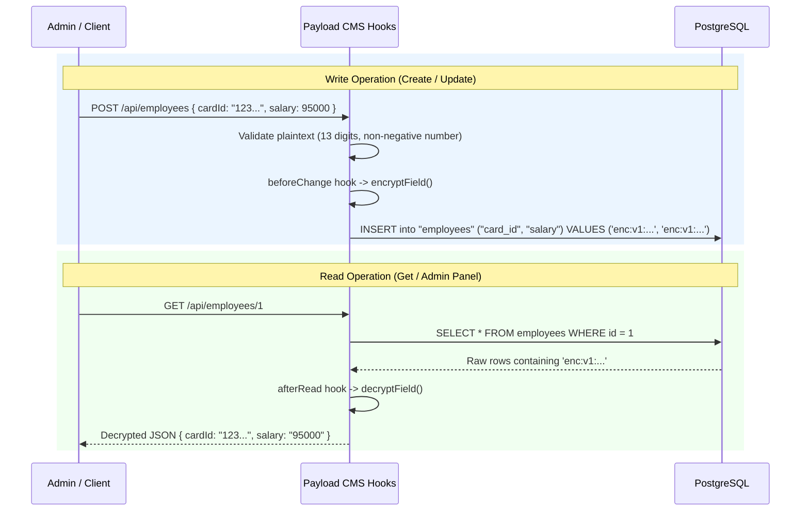

# Security Hardening: Field-Level Data Encryption (PDPA / OWASP A04)

> **Branch:** `security/field-encryption`  
> **Standard:** OWASP Top 10:2025 A04 (Cryptographic Failures) & PDPA Compliance  
> **Target Collection:** `Employees` (Sensitive PII: `cardId`, `salary`, `email`)

---

## 1. Executive Summary

In enterprise human resource and management systems, employee data contains critical **Personal Identifiable Information (PII)** and **Financial Data**, specifically:
- **`cardId`**: 13-digit National Identification Number (Citizen ID).
- **`salary`**: Monthly compensation and financial package.
- **`email`**: Corporate contact email address.

Under the **Personal Data Protection Act (PDPA)** and **OWASP A04 (Cryptographic Failures)**, storing sensitive PII in plaintext leaves the organization vulnerable to catastrophic data breaches in the event of database leaks, unauthorized SQL dumps, backup file theft, or disk compromise.

This module introduces **Field-Level Data Encryption (AES-256-GCM)** directly into the Payload CMS application layer. Even with full database access (`SELECT * FROM employees`), an attacker only observes cryptographically strong, authenticated ciphertexts.

---

## 2. Cryptographic Architecture

```
Plaintext:  "1100400123451"
                 │
                 ▼
          AES-256-GCM
      ┌────────────────────────────────────────────────────────┐
      │ Master Key:  ENCRYPTION_KEY (256-bit, 32 bytes)        │
      │ Random IV:   12 bytes (96 bits) per encryption         │
      │ Auth Tag:    16 bytes (128 bits) integrity seal        │
      └────────────────────────────────────────────────────────┘
                 │
                 ▼
Ciphertext: "enc:v1:<iv_24hex>:<authTag_32hex>:<ciphertext_hex>"
```

### Technical Specifications:
- **Algorithm:** `AES-256-GCM` (Galois/Counter Mode) via Node.js built-in `crypto`.
- **Mode of Operation:** Authenticated Encryption with Associated Data (AEAD).
- **Initialization Vector (IV):** 12 bytes (`crypto.randomBytes(12)`) freshly generated for **every single encryption** (NIST SP 800-38D). Eliminates deterministic patterns (two identical salaries or citizen IDs produce completely different ciphertexts).
- **Authentication Tag:** 16 bytes (`cipher.getAuthTag()`). Ensures data integrity and authenticity. Any unauthorized tampering or bit-flipping of ciphertext in the database triggers an authentication failure and rejects decryption.
- **Serialization Format:** `enc:v1:<iv_hex>:<authTag_hex>:<ciphertext_hex>`.
  - Prefix `enc:v1` enables algorithm versioning and smooth future key rotation.
  - Enables `isEncrypted()` check to provide **idempotency** (guards against accidental double-encryption).

---

## 3. Key Management (`ENCRYPTION_KEY`)

- The encryption key is a **32-byte (256-bit)** high-entropy binary secret.
- Injected strictly via environment variable (`ENCRYPTION_KEY`) in `.env` and `docker-compose.yaml`.
- **Zero Hardcoding:** The codebase contains **no hardcoded keys or fallback secrets**.
- **Fail-Closed Principle:** If `ENCRYPTION_KEY` is absent or not exactly 32 bytes, the encryption utility throws an explicit startup error to prevent unencrypted operations.

### Generating a Production Key:
```bash
node -e "console.log(require('crypto').randomBytes(32).toString('hex'))"
```

---

## 4. Payload CMS Lifecycle Integration

Hooks are attached to the `Employees` collection (`payload/src/collections/Employees.ts`):



---

## 5. Database Schema & Migration

Because `salary` was originally initialized as a PostgreSQL `numeric` column, storing ASCII ciphertext required altering the column to `varchar`:

**Migration: `payload/src/migrations/20260930_130000.ts`**
```sql
ALTER TABLE "employees" ADD COLUMN IF NOT EXISTS "email" varchar;
ALTER TABLE "employees" ALTER COLUMN "salary" TYPE varchar;
```
Applied automatically on Docker startup via idempotent `npx payload migrate`.

---

## 6. Verification and Test Results

### 6.1 Unit Tests (7/7 Passed)
Run with:
```powershell
node --experimental-strip-types scripts/test-encryption.mjs
```
- Master Key parsing (32 bytes valid).
- Round-trip encryption and decryption of Citizen ID and Salary.
- Double-encryption prevention (idempotency).
- Tamper detection (Auth Tag mismatch detected and rejected).
- Safe fallback for legacy/unencrypted data and null/empty inputs.

### 6.2 Raw PostgreSQL Database Inspection (Ciphertext Verified)
Query executed inside `69-s1-db`:
```sql
SELECT id, name, card_id, salary, email FROM employees WHERE id = 5;
```

**Result:**
```
 id |        name         | card_id                                                        | salary                                                         | email
----+---------------------+----------------------------------------------------------------+----------------------------------------------------------------+----------------------------------------------------------------
  5 | Natapong SecureTest | enc:v1:d85fe2a6d732ef113dd8f27b:db3a1a0e6266db98...:dce2b6... | enc:v1:bafe2e4fc085b7a027b931ca:69abd9889802bf51...:782ef4... | enc:v1:5d36b2a2658f0a6719a84658:d1e7ad52737709ee...:14e5a3...
```
*(All sensitive fields are stored as ciphertext; no plaintext citizen ID or salary is present in storage).*

### 6.3 Admin Panel & API Verification (Decrypted Verified)
When accessed through the Payload CMS Admin UI ([http://localhost:9092/admin](http://localhost:9092/admin)) or `GET /api/employees/5`:
```json
{
  "id": 5,
  "name": "Natapong SecureTest",
  "email": "natapong.s@cybersec.corp",
  "cardId": "1234567890123",
  "salary": "95000"
}
```
*(Authorized administrators view transparently decrypted information seamlessly).*
