# Security Architecture: Role-Based Access Control (RBAC) in Payload CMS

> **Branch:** `security/rbac-access-control`  
> **Standard:** OWASP Top 10:2025 A01 (Broken Access Control) & A03 (Privilege Escalation / Mass Assignment)  
> **Ecosystem:** Payload CMS v3 (Next.js App Router, TypeScript Code-First, PostgreSQL)

---

## 1. Executive Summary

In enterprise management systems, access control is the primary defense line protecting sensitive business data, corporate directories, and personal employee records. Without granular access boundaries, systems suffer from **OWASP A01: Broken Access Control** vulnerabilities such as:
- **Insecure Direct Object References (IDOR):** Any authenticated user viewing or modifying another employee's records or salary.
- **Privilege Escalation (Mass Assignment):** A malicious actor sending `"role": "admin"` during public registration to seize control of the application.
- **Unrestricted PII Exposure:** Revealing compensation (salary) or citizen identification numbers (`cardId`) to colleagues or unauthorized managers.

This project implements a complete, enterprise-grade **Role-Based Access Control (RBAC)** and **Attribute-Based Access Control (ABAC)** architecture directly within **Payload CMS v3**. Combining **Row-Level Query Scoping**, **Field-Level Access Rules**, and **Lifecycle Hook Defense-in-Depth**, the system enforces least privilege across all API endpoints and the admin panel.

---

## 2. Role Hierarchy & Access Architecture

```mermaid
graph TD
    subgraph Roles ["RBAC Identity & Roles"]
        SuperAdmin["Superadmin ('admins' collection or 'admin' role)"]
        HR["HR Specialist ('hr' role)"]
        Manager["Department Manager ('manager' role)"]
        Employee["Regular Employee ('employee' role)"]
        Anon["Public / Anonymous User"]
    end

    subgraph Collections ["Protected Collections & Resources"]
        UsersCol["Users & Auth Accounts"]
        EmpCol["Employees (PII + Compensation)"]
        DeptCol["Departments"]
        PosCol["Positions"]
        MediaCol["Media Uploads"]
    end

    SuperAdmin -->|Full System CRUD & User Management| UsersCol
    SuperAdmin -->|Full Access & Deletion| EmpCol
    SuperAdmin -->|Manage Org Structure| DeptCol
    SuperAdmin -->|Manage All Roles| PosCol

    HR -->|Read Directory & User List| UsersCol
    HR -->|Full CRUD + Decrypted Salary Access| EmpCol
    HR -->|Manage Job Titles| PosCol
    HR -.->|Read Only| DeptCol

    Manager -->|Self-Profile Only| UsersCol
    Manager -->|Scoped Read & Contact Update in Dept| EmpCol
    Manager -.->|Salary & CardId Masked / Stripped| EmpCol
    Manager -.->|Read Only| DeptCol

    Employee -->|Self-Profile Only| UsersCol
    Employee -->|Browse Directory / Self Record Full| EmpCol
    Employee -.->|Read Only| DeptCol

    Anon -->|Register as 'employee' Only| UsersCol
```



### Identity Architecture:
1. **Superadmin (`admins` collection or `role: 'admin'`):**
   - Retains full administrative governance across all collections.
   - Only entity permitted to delete employee records and modify user roles.
2. **HR Specialist (`role: 'hr'`):**
   - Manages employee lifecycles: onboarding, compensation adjustments, and personal records.
   - Full read access to all employees including decrypted salaries and national IDs.
   - Manages positions and views organization departments.
3. **Department Manager (`role: 'manager'`):**
   - Scoped access: Views and updates employees only within their assigned department.
   - **Privacy Boundary:** Sensitive PII (`salary`, `cardId`) is completely masked/omitted from API responses.
4. **Regular Employee (`role: 'employee'`):**
   - Directory Browsing: Can view the company directory (name, department, position).
   - **Self-Service ABAC:** Can view their *own* compensation and national ID, but cannot view colleagues' sensitive data.
5. **Anonymous / Public User:**
   - Permitted only to self-register via `POST /api/users`. Role is strictly pinned to `'employee'`.

---

## 3. Role & Permission Matrix (CRUD & Field Level)

| Resource / Action | Operation | Superadmin (`admin`) | HR Specialist (`hr`) | Department Manager (`manager`) | Regular Employee (`employee`) | Public / Anonymous |
|---|---|:---:|:---:|:---:|:---:|:---:|
| **Users** | Create | ✅ (Any Role) | ❌ | ❌ | ❌ | ✅ (Forced to `employee`) |
| | Read | ✅ (All Users) | ✅ (List Users) | 🔍 (Self Only) | 🔍 (Self Only) | ❌ |
| | Update | ✅ (All Users) | 🔍 (Self Only) | 🔍 (Self Only) | 🔍 (Self Profile Only) | ❌ |
| | Delete | ✅ | ❌ | ❌ | ❌ | ❌ |
| | **Field: `role`** | ✏️ Read/Write | ❌ Denied | ❌ Denied | ❌ Denied | ❌ Denied |
| **Employees** | Create | ✅ | ✅ | ❌ | ❌ | ❌ |
| | Read List | ✅ (All records) | ✅ (All records) | 🔍 (Own Dept) | 🔍 (Directory) | ❌ |
| | **Field: `salary` (Read)** | 👁️ Visible | 👁️ Visible | ❌ **Omitted (Masked)** | 👁️ **Self Only** | ❌ Denied |
| | **Field: `cardId` (Read)** | 👁️ Visible | 👁️ Visible | ❌ **Omitted (Masked)** | 👁️ **Self Only** | ❌ Denied |
| | Update Record | ✅ | ✅ (All Fields) | ✏️ (Contact Info, Dept) | ✏️ (Self Contact Only) | ❌ |
| | **Field: `salary` (Write)**| ✏️ Allowed | ✏️ Allowed | ❌ Forbidden | ❌ Forbidden | ❌ Denied |
| | Delete Record | ✅ | ❌ (Denied) | ❌ | ❌ | ❌ |
| **Departments** | Read | ✅ | ✅ | ✅ | ✅ | ❌ |
| | Write / Delete | ✅ | ❌ | ❌ | ❌ | ❌ |
| **Positions** | Read | ✅ | ✅ | ✅ | ✅ | ❌ |
| | Write (Create/Update)| ✅ | ✅ | ❌ | ❌ | ❌ |
| | Delete | ✅ | ❌ | ❌ | ❌ | ❌ |
| **Media** | Read | ✅ | ✅ | ✅ | ✅ | ❌ |
| | Upload | ✅ | ✅ | ✅ | ❌ | ❌ |
| | Delete | ✅ | ❌ | ❌ | ❌ | ❌ |

---

## 4. Key Security Implementations

### 4.1 Mitigation of Privilege Escalation & Mass Assignment (OWASP A01 / CWE-269)

When public registration is enabled (`POST /api/users`), attackers often attempt mass assignment by injecting administrative fields:
```json
POST /api/users
{
  "email": "attacker@evil.local",
  "password": "Password12345!",
  "role": "admin"
}
```

To prevent privilege escalation, our architecture applies **two independent defensive layers**:

1. **Payload Field-Level Access Control (`payload/src/lib/rbac.ts`):**
   ```typescript
   export const roleFieldAccess: FieldAccess = ({ req: { user } }) => {
     return isAdmin(user)
   }
   ```
   Payload checks field access before assigning incoming data. Since anonymous or non-admin requests return `false`, the submitted `role` is discarded and the schema default (`'employee'`) is applied.

2. **Lifecycle Hook Defense-in-Depth (`payload/src/collections/Users.ts`):**
   ```typescript
   beforeValidate: [
     ({ data, operation, req }) => {
       if (data && 'role' in data && data.role !== 'employee' && !isAdmin(req.user)) {
         data.role = 'employee'
       }
     }
   ]
   ```
   Even if request structures change or validation wrappers fail, the hook forcefully resets the role to `'employee'` before committing to the database.

---

### 4.2 Row-Level Access Control (Query Scoping)

In Payload CMS, returning a `Where` constraint from an `access` function transparently intercepts database queries, appending SQL `WHERE` clauses automatically:

```typescript
export const employeesReadAccess: Access = ({ req: { user } }) => {
  if (!user) return false
  if (isAdmin(user) || isHR(user)) return true

  // Department managers are automatically scoped to their department
  if (isManager(user)) {
    const deptId = getUserDepartmentId(user)
    if (deptId) {
      return { department: { equals: deptId } }
    }
  }

  // Regular employees can view general directory
  return true
}
```

---

### 4.3 Field-Level Access Control & Attribute-Based Security (ABAC)

Even when a Manager or Employee accesses an employee record, sensitive fields must not leak:

```typescript
export const salaryFieldReadAccess: FieldAccess = ({ req: { user }, doc }) => {
  if (!user) return false
  if (isHR(user)) return true

  // Self-Read ABAC: Employees can view their own compensation
  if (doc && user.email && doc.email === user.email) return true

  // All other users (Managers, peers) receive a masked/omitted response
  return false
}
```

**Result:** When an unauthorized role queries `/api/employees`, Payload's serializer completely strips the `salary` and `cardId` properties from the JSON response before transmitting it over HTTP.

---

### 4.4 Synergistic Defense: Field Encryption (AES-256-GCM) + RBAC

Our system employs **Defense-in-Depth** by combining cryptographic encryption at rest with runtime RBAC:

```
[ Incoming Request: GET /api/employees ]
               │
               ▼
┌───────────────────────────────┐
│     Payload Access Check      │  ── (RBAC & Where filter applied)
└──────────────┬────────────────┘
               │
               ▼
┌───────────────────────────────┐
│  PostgreSQL Database Storage  │  ── Stored as AES-256-GCM Ciphertext:
│                               │     "enc:v1:<iv>:<tag>:<ciphertext>"
└──────────────┬────────────────┘
               │
               ▼
┌───────────────────────────────┐
│    afterRead Lifecycle Hook   │  ── Decrypts ciphertext in memory
└──────────────┬────────────────┘
               │
               ▼
┌───────────────────────────────┐
│    Field-Level Access Eval    │  ── Is user Admin, HR, or Document Owner?
└──────────────┬────────────────┘
         Yes ┌─┴─┐ No
             ▼   ▼
  [ Decrypted Field ]   [ Field Stripped / Redacted ]
```

- **Database compromise:** Stolen database backups reveal only authenticated ciphertexts (AES-256-GCM).
- **Application access:** Authenticated users see only what their assigned role and identity permits.

---

## 5. Database Schema & Migration

### Migration: `payload/src/migrations/20261003_140000.ts`
```sql
-- 1. Create Enum for RBAC roles
DO $$ BEGIN
  CREATE TYPE "public"."enum_users_role" AS ENUM('admin', 'hr', 'manager', 'employee');
EXCEPTION
  WHEN duplicate_object THEN null;
END $$;

-- 2. Add role column with default 'employee' (fail-safe)
ALTER TABLE "users" ADD COLUMN IF NOT EXISTS "role" "enum_users_role" DEFAULT 'employee' NOT NULL;

-- 3. Add department relationship for manager scoping
ALTER TABLE "users" ADD COLUMN IF NOT EXISTS "department_id" integer REFERENCES "departments"("id") ON DELETE SET NULL;

-- 4. High-performance indexes
CREATE INDEX IF NOT EXISTS "users_role_idx" ON "users" ("role");
CREATE INDEX IF NOT EXISTS "users_department_idx" ON "users" ("department_id");
```

---

## 6. Testing & Verification

### 6.1 Automated Vitest Test Suite (`payload/tests/int/rbac.int.spec.ts`)
The project includes automated integration tests verifying:
- ✅ Role hierarchy resolution (Admin, HR, Manager, Employee)
- ✅ Privilege escalation blocking on public user registration
- ✅ Employees collection CRUD access policies
- ✅ Sensitive PII field stripping for unauthorized managers & peers
- ✅ Self-service salary viewing for record owners

Run tests via:
```bash
npm run test:int
```

### 6.2 REST Client Verification Suite (`api.http` / `api.http.simple`)
Interactive test requests demonstrate real-world enforcement:
1. **Superadmin Login:** `admin@cybersec.local` (Full access).
2. **HR Login:** `hr_user@cybersec.local` (Can view/update salaries, blocked from deleting records).
3. **Manager Login:** `manager_user@cybersec.local` (Can update contact details in own department, salaries stripped).
4. **Employee Login:** `somchai.j@cybersec.local` (Can view own salary, colleague salaries omitted).
5. **Privilege Escalation Test:** Register with `role: "admin"` → Verify role defaults to `"employee"`.

---

## 7. Comparative Analysis: Payload CMS (Code-First) vs Strapi (GUI-First)

| Access Control Dimension | Payload CMS (Implemented) | Strapi v4 |
|---|---|---|
| **Access Definition Model** | **Code-First (TypeScript):** Policies written in declarative code and version-controlled via Git. | **GUI-First (Admin Panel):** Permissions checked via checkboxes on the admin dashboard. |
| **Field-Level Access Control** | **Native & Granular:** Every field accepts dynamic `access.read` and `access.update` functions evaluating request context. | **Enterprise Only / Custom:** Community Edition lacks granular field-level read/write permissions. |
| **Row-Level Query Filtering** | **Native `Where` Object:** Access functions return query constraints seamlessly injected into SQL queries. | Requires custom controller middleware or lifecycle interceptors. |
| **Privilege Escalation Guard** | Built-in field access rejection + hook enforcement with zero boilerplate. | Prone to misconfigured public role permissions in database dumps. |
| **CI/CD & Auditability** | 100% testable via Vitest/Jest; easily scanned with static analysis (SAST) and code reviews. | Difficult to audit diffs between environments (stored across database tables). |

---

## 8. Conclusion

By implementing Role-Based Access Control via Payload CMS's native code-first capabilities, this system establishes a verifiable, zero-trust authorization model. Sensitive HR and employee records are safeguarded from unauthorized read, modification, and privilege escalation, achieving full alignment with **OWASP Top 10:2025 A01 (Broken Access Control)** and enterprise privacy requirements.
